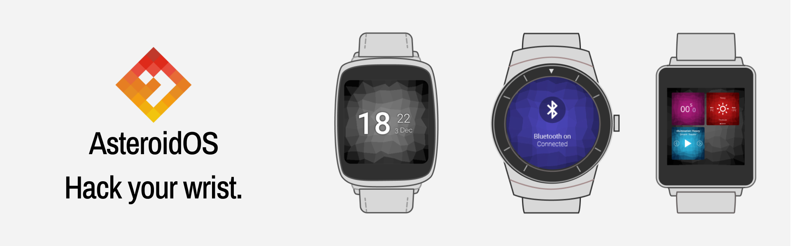

# AsteroidOS
<a href="https://asteroidos.org" target="_blank">AsteroidOS</a> is an open source operating system designed for smartwatches. It is available as a firmware replacement for some Android Wear devices. It has been created with modularity, freedom and transparency in mind, and it offers a set of apps including everything needeed on a smartwatch.

## Alpha version
There was no previous research on the usability of the product. I decided to first focus on the lift in UI design while leaving user flows and patterns untouched. The idea was to first get-go a branding strategy and attract new community members willing to contribute to the project.
Alpha version resulted in improving and adding new design elements by: 
- updating the typography to Open Sans and Archivo Narrow 
- adding consistent iconography and guidelines on how to use them
- creating innovative, moving background "Lifely" (the core of the brand)
- cleaning UI and achieving consistency
- conducting community page audit, proposing changes and designing a new version </br></br>

::::{grid}
:gutter: 3

:::{grid-item-card}
```{thumbnail} /_static/asteroidos/asteroid-os-colours.png
    :group: launcher
```
:::
:::{grid-item-card}
```{thumbnail} /_static/asteroidos/asteroid-os-applauncher.png
    :group: launcher
```
:::
::::

</br>
Additionally, I conducted UX audits of the navigation and the apps and created some assumptions where potentially the user might struggle while using the smartwatch with asteroidOS installed on it. </br></br>

::::{grid}
:gutter: 3

:::{grid-item-card}
```{thumbnail} /_static/asteroidos/asteroios-ux-1.png
    :group: asteroid-ux
```
:::
:::{grid-item-card}
```{thumbnail} /_static/asteroidos/asteroios-ux-2.png
    :group: asteroid-ux
```
:::
:::{grid-item-card}
```{thumbnail} /_static/asteroidos/asteroios-ux-3.png
    :group: asteroid-ux
```
:::
::::


## asteroidOS Stable
The stable version supported four smartwatch models (LG G Watch, LG G Watch Urban, Sony Smartwatch 3, and Asus Zenwatch 2). The main view of the operating system was based on the cross panel with the Watch Face Screen in the middle, Quick Settings, App Minimizer, Feed View, and App Launcher located on the cross arms. The Stable version included a set of native apps: an Alarm Clock, Calculator, Calendar, Music, Settings, Stopwatch, Timer, and Weather apps. </br></br>

::::{grid}
:gutter: 3

:::{grid-item-card}
```{thumbnail} /_static/asteroidos/asteroidos-launcher-01.png
    :group: asteroid-ui
```
:::
:::{grid-item-card}
```{thumbnail} /_static/asteroidos/asteroidos-launcher-02.png
    :group: asteroid-ui
```
:::
:::{grid-item-card}
```{thumbnail} /_static/asteroidos/asteroidos-launcher-03.png
    :group: asteroid-ui
```
:::
:::{grid-item-card}
```{thumbnail} /_static/asteroidos/asteroidos-launcher-03.png
    :group: asteroid-ui
```
:::
::::

::::{grid}
:gutter: 3

:::{grid-item-card}
```{thumbnail} /_static/asteroidos/asteroidos-settings-01.png
    :group: asteroid-ui
```
:::
:::{grid-item-card}
```{thumbnail} /_static/asteroidos/asteroidos-settings-02.png
    :group: asteroid-ui
```
:::
:::{grid-item-card}
```{thumbnail} /_static/asteroidos/asteroidos-settings-03.png
    :group: asteroid-ui
```
:::
:::{grid-item-card}
```{thumbnail} /_static/asteroidos/asteroidos-settings-03.png
    :group: asteroid-ui
```
:::
::::

::::{grid}
:gutter: 3

:::{grid-item-card}
```{thumbnail} /_static/asteroidos/asteroidos-apps-01.png
    :group: asteroid-ui
```
:::
:::{grid-item-card}
```{thumbnail} /_static/asteroidos/asteroidos-apps-02.png
    :group: asteroid-ui
```
:::
:::{grid-item-card}
```{thumbnail} /_static/asteroidos/asteroidos-apps-03.png
    :group: asteroid-ui
```
:::
:::{grid-item-card}
```{thumbnail} /_static/asteroidos/asteroidos-apps-03.png
    :group: asteroid-ui
```
:::
::::

After the alpha version rollout, I flagged usability testing, observing and measuring how the users interact with the product as our highest priority. We wanted to know where we ought to improve the usability. We also wanted to estimate what future apps the users would be interested in using and be better informed while structuring the roadmap.

### Usability Testing
I planned the usability test according to the assumptions derived from the previous audits: 
- Navigating the system is not intuitive, and the users will score high learning how to use it. 
- The Alarm Clock features are limited and will score low in the user satisfaction scoring.
- The calculator app, especially on rounded screens, has poor usability - the number is hard to select, and the completion of the tasks will have low time scores.
- The Agenda app has a complex structure, and the users will struggle to solve the testing tasks.

Considering the assumptions, I prepared the test scenario and follow-up questions:

`````{admonition} Tasks
1. Turn on the watch face.
2. Find the Alarm app.
3. Set up the alarm for Friday at 15:49.
4. Navigate to the Calculator app and calculate 45 - 5 * 5.
5. Navigate to the Agenda app and find out what events were on 15.04.2017.
6. Lock the main screen.
`````

`````{admonition} Follow Up Questions
:class: tip
1. In which situations you can imagine yourself using a smartwatch? 
2. Which apps on your smartphone do you use the most frequently?
`````

The test was then conducted with eight users and recorded with a camera. Next, I transcripted each recording, measured the tasks results and stored them in a test report as a reference for the future. 

### asteroidOS 1.0
After the Stable version release, we conducted a series of workshops to analyze the community effort and the usability research results and to plan the roadmap for the asteroidOS 1.0 version. Then, I contributed a proposal to the design principles and created a user experience and design deliverables with improved usability of several apps. 

