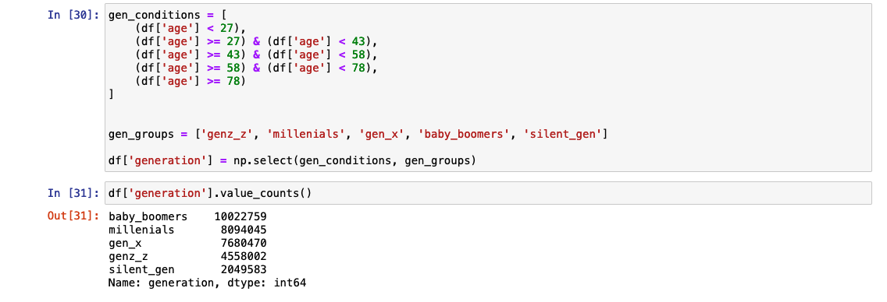
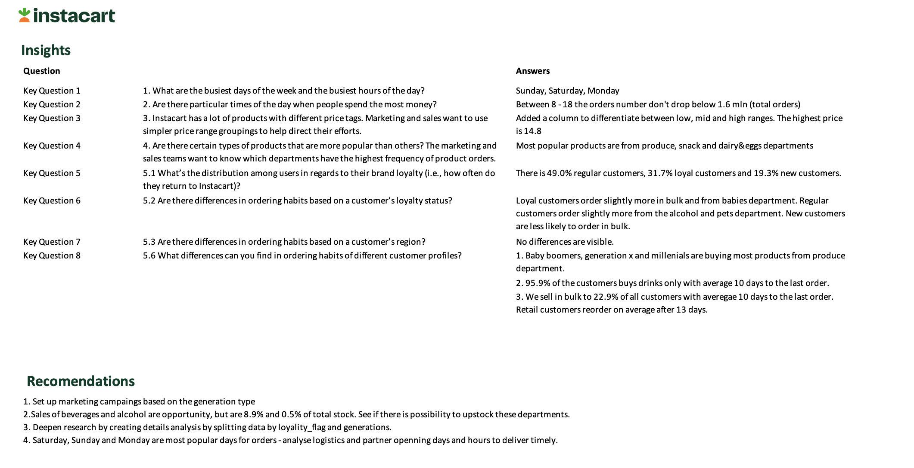

# instacart Data Set
instacart is an online grocery store that operates through an app. As a way to find good data scientists and get ideas from the community, Instacart has released some of their data. The anonymized dataset contains a sample of aprox. 3 million grocery orders from more than 200,000 Instacart users. According to their <a href="https://tech.instacart.com/3-million-instacart-orders-open-sourced-d40d29ead6f2">article published on Medium</a>:

> For each user, we provide between 4 and 100 of their orders, with the sequence of products purchased in each order. We also provide the week and hour of day the order was placed, and a relative measure of time between orders.

## Objectives 
```{admonition} Learning objectives
:class: dropdown
- learn new Python libraries
- prepare data for analysis and conduct some fundamental data engineering tasks using large amounts of data 
- create data visualisations with Python
```
```{admonition} Project objectives
:class: dropdown
Instacart already has very good sales, but they want to uncover more information about their sales patterns. The project obejctive is to perform an initial data and exploratory analysis of some of their data to derive insights and suggest strategies for better segmentation based on the provided criteria.
```
## Planning & Research
First I identified potential stakeholders and what they needed to know. I derived the most pressing questions that I could address with the dataset. I also explored the datasets in broad terms. I created a population flow chart to organize and synthesize the data in a neat, structured way. Finally, I established the final data frame requirements - the data frame on which I planned to conduct the in-depth analysis.
### Stakeholders 
The Instacart stakeholders are most interested in customers purchasing behaviors and their segmentation. They want to target different customers with applicable marketing campaigns to see whether they affect the sale of their products.

> **Vice President of Marketing** <br/> “We’re always looking into improving our targeting for ad campaigns.”

> **Senior Vice President of Sales** <br/>"We need to know what part of our offering has the lowest market share and why. Based on this input, we could improve this sector and boost sales.”

### Key questions

```{admonition} Time
:class: tip, dropdown
- The sales team needs to know what the busiest days of the week and hours of the day are (i.e., the days and times with the most orders) in order to schedule ads at times when there are fewer orders.
- They also want to know whether there are particular times of the day when people spend the most money, as this might inform the type of products they advertise at these times.
```

```{admonition} Departments
:class: tip, dropdown
- Are there certain types of products that are more popular than others? 
- The marketing and sales teams want to know which departments have the highest frequency of product
orders.
```
```{admonition} Customers
:class: tip, dropdown
- What are the different types of customers in the system and how their ordering behaviors differ?
- What’s the distribution among users in regards to their brand loyalty (i.e., how
often do they return to Instacart)?
- Are there differences in ordering habits based on a customer’s loyalty status?
- Are there differences in ordering habits based on a customer’s region?
```
```{admonition} Pricing
:class: tip, dropdown
- Instacart has a lot of products with different price tags. Marketing and sales want to use
simpler price range groupings to help direct their efforts.
```

### Dataset 
#### Population Flow

<iframe src="https://miro.com/app/live-embed/uXjVMHuEmqI=/?moveToViewport=-1384,-761,2929,1521&embedId=898286255048" scrolling="no" allow="fullscreen; clipboard-read; clipboard-write" allowfullscreen width="768" height="432" frameborder="0"></iframe>

#### Data Preparation Plan
1. Import each Dataframe into the separate notebook.
2. Conduct initial exploration.
3. For each Dataframe conduct data cleansing and wrangling.
4. For each Dataframe conduct descriptive statistics.
5. Update Data Dictionary.
6. Perform necessary data combination (see next Section "Population flow" for details).

#### Final Dataframe Requirements 
```{admonition} Requirements
1. All project data has been merged into a single data set. 
2. A frequency of the merge flag
shows the merged data set is a 100% match to the combined original data sets.
3. Merged data set only contains variables to be used in the analysis.
```

## Data Cleansing & Wrangling
With a good understanding of the project's scope, I was ready to move on to the next phase. For data wrangling with Python, I decided to use the Anaconda distribution. 
First, I examined each data frame and its variables. I performed data type checks and looked for inconsistencies, missing or duplicated values, and outliers. Then I documented each data frame in the data dictionary, including raw and clean versions documentation. I then merged the clean data frames into a final set, which I later used for the final analysis and data visualization. 

### Data Frames
One interesting case that I discovered during the data cleansing was the `family_status` variable available in the customer's data frame. I was hoping to use that data for future analysis and data visualization. After checking the contents in detail, I realized that there are some values in "living with family and siblings" that had less than three family members. Also, it was unclear why the variable `divorced/widowed` was grouping two different family statuses. As a result, I decided to drop an entire column and focus on the age groups instead. 


### Flags
#### User activity by hourly ranges
The time of the day with the highest order frequency was one of the core answers I searched for. 
I wanted to approach the research scientifically, so I counted the orders for each hour and then calculated the statistics that helped me to divide the day into three groups. Then I created an empty array and looped the data frame assigning most/average/fewest orders flags. 


#### User by age
I often see numerical approaches to age segmentation, for example, 0-18, 19-25, 26-35, 36-64, 65+. I think this type of grouping was effective for looking at mortality rates in my previous project, where I was interested in the age at which people died. 
In the case of the Instacart data analysis, a more valuable approach is generational segmentation. There are a lot of behavioral studies dedicated to generational segmentation. Furthermore, this type of segmentation would be helpful when using a "jobs-to-be-done" framework to understand user needs. Lastly, each generation has different daily habits of using media. Segmenting by generations could help in targeting ad campaigns.

Below you can see a code snippet with segmentation by generations - generations ranges are based on Pew Research Center data.


### Data Dictionary
A data dictionary wasn't a requirement for this project. However, during the planning phase, I realized that I would be dealing with many data frames and variables that I would be updating or changing. I decided that spending some time setting up a data dictionary structure would benefit me in the future and make my work more efficient. 

Example of the data dictionary with two data frames:
#### products
:::::{tab-set}
::::{tab-item} Current version
:::{card}
products (49672 rows, 4 columns):
^^^
:::{list-table}
:header-rows: 1
*   - Column name
    - Data type
    - Description
    - Log
*   - `product_id` {bdg-warning}`key`
    - `str`
    - Product identificator. 
    - {bdg-info}`changed-dtype`
*   - `product_name`
    - `str`
    - Product name.
    - 
*   - `department_id` {bdg-warning}`key`
    - `str` 
    - Department identificator.
    - {bdg-info}`changed-dtype`
*   - `prices`
    - `float64`
    - Product price in USD
    - 
:::
::::
::::{tab-item} Raw version
:::{card}
products (49693 rows, 5 columns):
^^^
:::{list-table}
:header-rows: 1
*   - Column name
    - Data type
    - Description
    - Log
*   - `product_id` {bdg-warning}`key`
    - `int64`
    - Product identificator. Changing data type.
    - {bdg-info}`changing-dtype`
*   - `product_name`
    - `str`
    - Product name.
    - 
*   - `aisle_id`
    - `int64`
    - Aisle indetificator. Irrelevant, dropping.
    - {bdg-danger}`dropping`
*   - `department_id` {bdg-warning}`key`
    - `int64` 
    - Department identificator. Changing data type
    - 
*   - `prices`
    - `float64`
    - Product price in USD. 
    - {bdg-info}`changing-dtype`
:::
::::
:::::

#### product-orders-prior
:::::{tab-set}
::::{tab-item} Current version
:::{card}
order-products-prior (32434489 rows, 4 columns):
^^^
:::{list-table}
:header-rows: 1
*   - Column name
    - Data type
    - Description
    - Log
*   - `order_id` {bdg-warning}`key`
    - `str`
    - Order identificator. Changed data type.
    - {bdg-info}`changed-dtype`
*   - `product_id` {bdg-warning}`key`
    - `str`
    - Product identificator. Changed data type.
    - {bdg-info}`changed-dtype`
*   - `add_to_cart_order`
    - `int64`
    - 
    - 
*   - `reordered`
    - `int64`
    - Number of reorders.
    - 
:::
::::
::::{tab-item} Raw version
:::{card}
order-products-prior (32434489 rows, 4 columns):
^^^
:::{list-table}
:header-rows: 1
*   - Column name
    - Data type
    - Description
    - Log
*   - `order_id` {bdg-warning}`key`
    - `int64`
    - Order identificator. Changing data type.
    - {bdg-info}`changing-dtype`
*   - `product_id` {bdg-warning}`key`
    - `int64`
    - Product identificator. Changing data type.
    - {bdg-info}`changing-dtype`
*   - `add_to_cart_order`
    - `int64`
    - 
    - 
*   - `reordered`
    - `int64`
    - Number of reorders.
    - 
:::
::::
:::::

## Data Insights
For the final stage of the project, I used a final data frame created by merging data frames containing product, order, customer, and department data. 
I did a quick data consistency check and ran some basic descriptive statistics to ensure quality. 

Next, I grouped the states into four regions to investigate later the tendencies on the regional level. I also divided the customers by spending type and created low and high spenders flags. Additionally, I grouped the customers by income and loyalty level. 

### Time
Following the plan and the project's requirements, I started the analysis by answering the time-related questions. I first calculated the user activity and expenditure difference during the day, the order frequency, and the customers spending for each weekday. Next, I grouped the states into four regions to investigate later the tendencies on the regional level. 

::::{grid}
:gutter: 3

:::{grid-item-card}
:columns: 6
```{thumbnail} /_static/instacart/time-day-activity.png
    :group: customers
```
:::
:::{grid-item-card}
:columns: 6
```{thumbnail} /_static/instacart/time-week-frequency.png
    :group: customers
```
:::
:::{grid-item-card}
:columns: 6
```{thumbnail} /_static/instacart/time-spending-weekdays.png
    :group: customers
```
:::
:::{grid-item-card}
:columns: 6
```{thumbnail} /_static/instacart/time-expediture-difference.png
    :group: customers
```
:::
::::

---
### Departments
I was interested in patterns that appeared in the departmental data. I discovered an intriguing value indicating that instacart has customers who place bulk orders. I compared customers who only ordered in bulk with those ordering from other departments. 
Next, I investigated the popularity of the departments by spending and income type, loyalty status, and generation group.

::::{grid}
:gutter: 3

:::{grid-item-card}
:columns: 4
```{thumbnail} /_static/instacart/product-gen-departments.png
    :group: products
```
:::
:::{grid-item-card}
:columns: 4
```{thumbnail} /_static/instacart/products-regions.png
    :group: products
```
:::
:::{grid-item-card}
:columns: 4
```{thumbnail} /_static/instacart/loyalty_department_viz.png
    :group: products
```
:::
:::{grid-item-card}
:columns: 4
```{thumbnail} /_static/instacart/income_department_viz.png
    :group: products
```
:::
:::{grid-item-card}
:columns: 4
```{thumbnail} /_static/instacart/product-buyer-type-departments.png
    :group: products
```
:::
:::{grid-item-card}
:columns: 4
```{thumbnail} /_static/instacart/products-spending-type.png
    :group: products
```
:::
:::{grid-item-card}
:columns: 4
```{thumbnail} /_static/instacart/department-retail-whole.png
    :group: products
```
:::
::::

---
### Customers
In line with my earlier plans, I based customer data analysis on generational segmentation. I also added regional dimensions to the research. 
I first calculated the customer distribution by loyalty status. 
Then I mapped the distribution of the generations by region. I also was interested in the generation group scoring highest in the loyalty status. To my surprise, all groups have shown similar loyalty status. Looking further for business opportunities, I checked for customers who ordered only drinks, beverages, and alcohol. Interestingly there was a relatively low number of products available in these departments and high order numbers. 


::::{grid}
:gutter: 3

:::{grid-item-card}
:columns: 4
```{thumbnail} /_static/instacart/heatmap_gen_dep_viz.png
    :group: customers
```
:::
:::{grid-item-card}
:columns: 4
```{thumbnail} /_static/instacart/gen_customers_viz.png
    :group: customers
```
:::
:::{grid-item-card}
:columns: 4
```{thumbnail} /_static/instacart/generations_region_viz.png
    :group: customers
```
:::
:::{grid-item-card}
:columns: 8
```{thumbnail} /_static/instacart/customers-gender.png
    :group: customers
```
:::
:::{grid-item-card}
:columns: 4
```{thumbnail} /_static/instacart/loyalty_region_viz.png
    :group: customers
```
:::
:::{grid-item-card}
:columns: 4
```{thumbnail} /_static/instacart/customer-types.png
    :group: customers
```
:::
:::{grid-item-card}
:columns: 4
```{thumbnail} /_static/instacart/customer-income.png
    :group: customers
```
:::
:::{grid-item-card}
:columns: 4
```{thumbnail} /_static/instacart/customers-drinks-only.png
    :group: customers
```
:::
::::

---
### Prices
The last part of the project requirement was setting the price range flags. I additionally calculated the product price density. 
::::{grid}
:gutter: 3

:::{grid-item-card}
:columns: 6
```{thumbnail} /_static/instacart/product-price-density.png
    :group: prices
```
:::
:::{grid-item-card}
:columns: 6
```{thumbnail} /_static/instacart/price-ranges.png
    :group: prices
```
:::
::::

### Results 
At the end of the research, I exported all visualization into the files and embedded them into the Excel report. 
The file included a population flow diagram, consistency checks, wrangling steps, and column derivations tables. Additionally, I provided a dashboard-like two pages with visualizations of customers and marketing & sales topics. I ended by summarising the findings and making a short list of recommendations.



---
*Note: I sourced the instacart logo and the 3d graphic from publicly available resources. I don't own the copyrights for these assets.*


