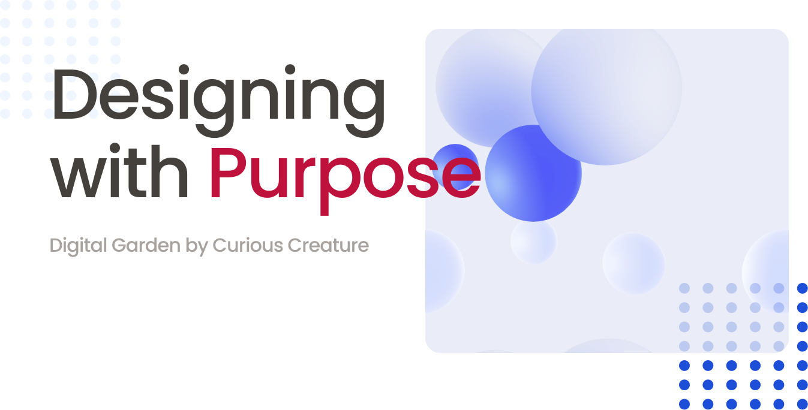
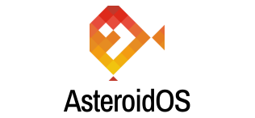

<!---
## Design Ops Case Studies

(cards-clicable)=
::::{grid} 2
:gutter: 4

:::{grid-item-card}  
:link: abds.html
Design System
^^^

+++
Cyber security Management SaaS.
:::
:::{grid-item-card}  
:link: ab-ops.html
Design Team Operations
^^^

+++
Cyber security Management SaaS.
::::

---

## Product Design Case studies

(cards-clicable)=
::::{grid} 2
:gutter: 4

:::{grid-item-card}  
:link: asteroidos.html
Usability, User Experience & Product Design
^^^

+++
Smartwach Operating System.
:::
:::{grid-item-card}  
:link: viffie.html
Research, User Experience & Product Design
^^^

+++
Remote work &  productivity tool.
:::
::::

---

## Data Analytics Case Studies

(cards-clicable)=
::::{grid} 2
:gutter: 4

:::{grid-item-card}  
:link: influenza.html
Data Research, Analysis & Visualization 
^^^

+++
Data Analysis to predict medical staff allocation.
:::
:::{grid-item-card}  
:link: instacart.html   
E-commerce Business Analysis & Visualization
^^^

+++
instacart dataset analysis for sales & marketing.
:::
::::

--!>

